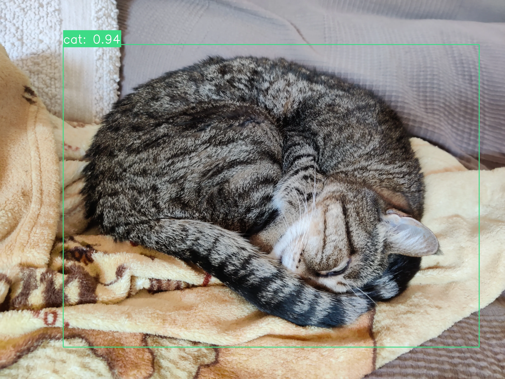
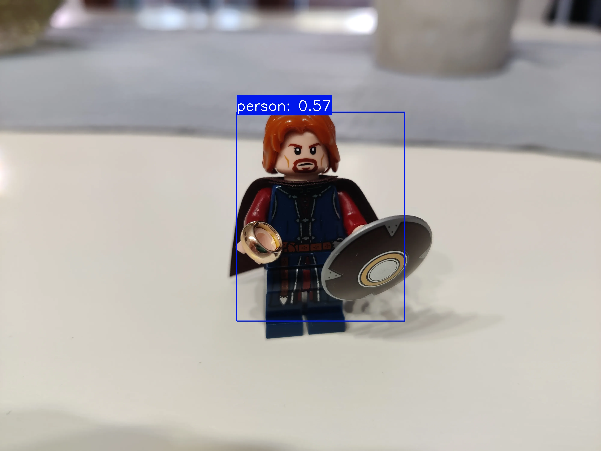
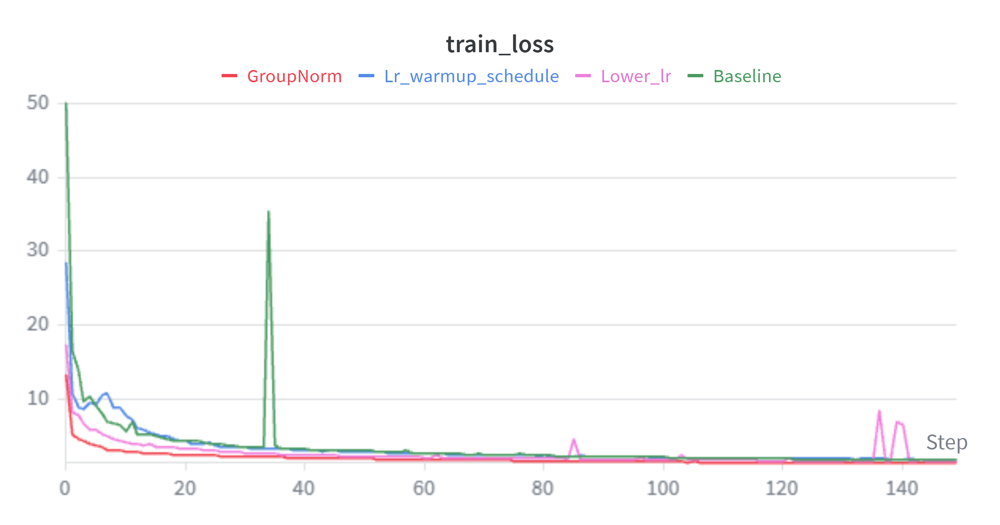
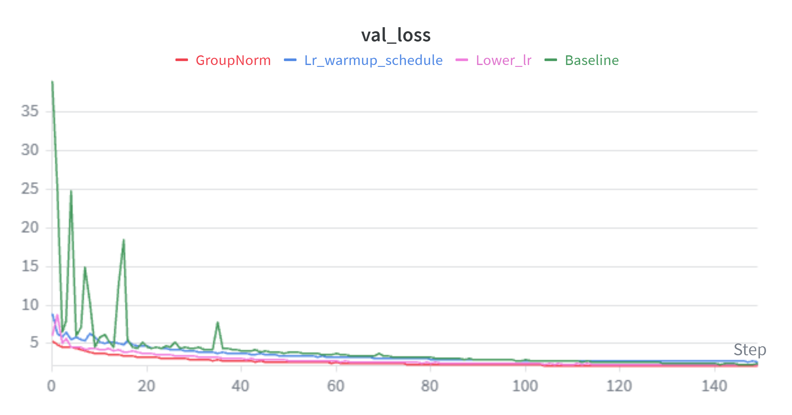
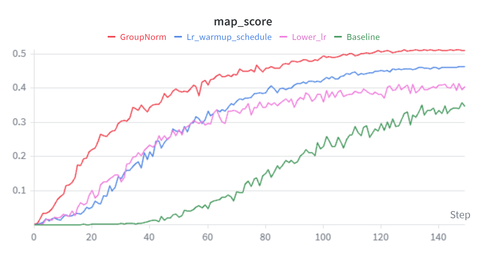

# YOLOv1 Pytorch.


A PyTorch implementation of the original YOLOv1 object detector, including the Darknet backbone, classification and detection heads, custom YOLO loss, IoU, Non-Maximum Suppression (NMS), and mAP evaluation. The backbone is first pretrained on Tiny-ImageNet-200 and then transferred to Pascal VOC 2007+2012 for object detection while keeping the backbone frozen during detector training.

The repository comprises:
- Complete YOLOv1 implementation from scratch
- PascalVOC data preprocessing and csv file creation
- PascalVOC custom dataset creation
- Implementation of IoU
- Implementation of mAP
- Validation with mAP
- Learning Rate warmp-up and scheduling
- Inference pipeline with visualization
- YAML configurable training

## Installation
To download and install the repository, run the following commands:
```
git clone https://github.com/RickyPyeet/yolov1-pytorch
cd yolov1-pytorch
pip install -r requirements.txt
```

## Training
Training is configured and can be modified via `configs/voc.yaml`.

To train the model:
1. First download and preprocess PascalVOC via:
```
python download_voc.py
```

2. Download the backbone weights from [HuggingFace](https://huggingface.co/Pitto16/yolov1-weights/tree/main) choosing `pretrained_backbone_tinyimagenet_200.pt` and putting it into the `checkpoints/` folder

3. Train the model via:
```
python train.py
```
> **NOTE**
> Training experiments were performed on Google Colab using an NVIDIA RTX PRO 6000 GPU

## Inference
Detection is performed by:

1. Download the weights from [HuggingFace](https://huggingface.co/Pitto16/yolov1-weights/tree/main) choosing `yolov1.pt` and putting it into the `checkpoints/` folder

2. Run the following command:
```
python detect.py --checkpoint checkpoints/yolov1.pt --config configs/voc.yaml --nms_threshold --img_path "path/to/image/to/detect" --save_path "path/to/save/img" --save_img -seed
```

Note that:
- `--nms_thresholds` defaults as `0.2` but can be changed
- `--save_path` is only required if `--save_img` is `True`
- `--seed` defaults to `42` 

## Demo
A demo of the model can be used and visualized in the following Hugging Face Space: https://huggingface.co/spaces/Pitto16/YOLOv1?logs=container

<table>
<tr>
<td align="center">

</td>

<td align="center">

</td>
</tr>
</table>

## Results
Experiments were conducted using [Weights and Biases](https://wandb.ai/site/) to monitor:
- **Training Stability**
- **Mean Average Precision (mAP) scores**

By applying `Randomized Search` and `Grid Search` the following results were noticed:
1. Starting LR value made a big impact on training performance
2. Adding LR warm-up and schedule improved the initial training stability, making the model start converging faster (c.a. 20 epochs earlier)
3. Replacing BatchNorm with GroupNorm resulted in more stable optimization, faster convergence (c.a. 40 epochs earlier), and a higher validation mAP

<table>
<tr>
<td align="center">
<b>Training Loss</b><br>

</td>

<td align="center">
<b>Validation Loss</b><br>

</td>

<td align="center">
<b>mAP</b><br>

</td>
</tr>
</table>

- **Baseline** = High Learning Rate (1e-4), no warm-up and schedule, BatchNorm
- **Lower Learning Rate** = Lower learning rate (5e-5), no warm-up and schedule, BatchNorm
- **Lr Warm-up + Cosine Scheduler** = lower learning rate, linear warm-up and cosine scheduler, Batch Norm
- **GroupNorm** = lower learning rate, linear warm-up and cosine schedule, Group Norm

## Limitations
The model has the following limitations that can be examined and worked on in the future:
- Weak localization
- Overconfidence on some classes
- Low confidence on other classes

## Reference
- [Redmon et al., You Only Look Once: Unified, Real-Time Object Detection](https://arxiv.org/abs/1506.02640)


